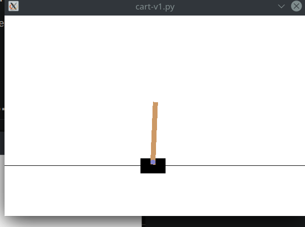

# OpenAI Gym CartPole with a Reinforcement Learning Agent
# What is OpenAI's Gym?

OpenAI's gym exists as a platform to test and standardize reinforcement learning agents and create consistent reproducible models. In this repo, we'll be taking a look at the CartPole task, a pole sits atop a cart, from which that cart must learn to balance the pole.

## Installing prerequisites
pip3 install gym
pip3 install scikit-learn

## Running these tests

The tests are splt into two files, cart-v0.py and cart-v1.py 
cart-v0.py is a testing playground for implementing a hard coded policy function and a random action policy. You can uncomment these two different lines to test them.

cart-v1.py is a playground for the test that utilizes Q-learning to learn to balance the pole atop the cart.

python3 cart-v0.py

python3 cart-v1.py

## After enough episodes you'll get...

